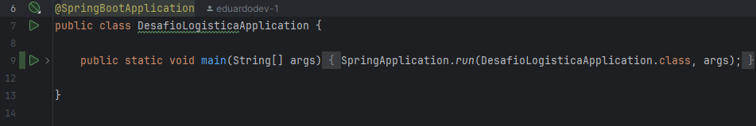
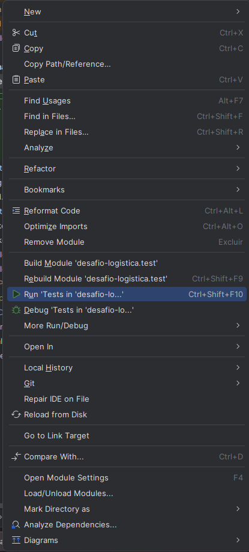
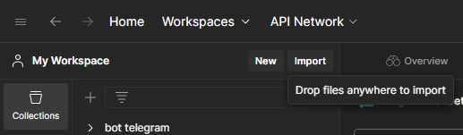
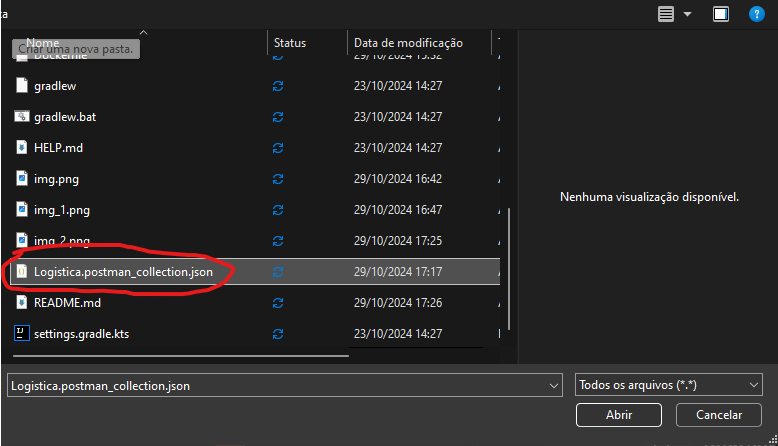
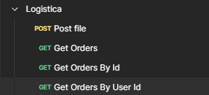

# Desafio-Logistica

## Requisitos

- Docker
- Docker Compose
- Java 21

## Instruções para Rodar a Aplicação

### Passo 1: Iniciar o Banco de Dados

Na raiz do projeto, execute o seguinte comando para iniciar o banco de dados usando o `docker-compose.yml`:

```bash
docker-compose up -d
```

### Passo 2: Rodar a Aplicação
Depois que o banco de dados estiver em funcionamento,
você pode rodar a aplicação usando um dos seguintes comandos, dependendo do seu sistema operacional:

# Linux ou WSL 2.0
Abra o terminal na raiz do projeto e execute:
```bash
sudo ./gradlew bootRun
```
# Utilizando a IDE (Intelij)
Aperte o play ao lado do nome da classe Main


## Instruções para Executar os testes.
# Utilizando a IDE (Intelij)
Clique com o direito na pasta "test" e depois em Run 'Tests'

# Linux ou WSL 2.0
Abra o terminal na raiz do projeto e execute:
```bash
sudo ./gradlew test
```

### Passo 3: Executar os endpoints

# Postman
1 - Abra o postman e em collections, clique em import


2 - Selecione o arquivo Logistica.postman_collection.json e clique em ok.

3 - Agora você terá acesso a todos os endpoints disponíveis

## API Endpoints

### 1. Upload de Arquivo

**POST** `/api/file`

Este endpoint permite o upload de um arquivo e armazena seus dados no banco de dados.

- **URL**: `/api/file`
- **Método**: `POST`
- **Parâmetros**:
    - `file` (obrigatório): o arquivo a ser enviado, do tipo `multipart/form-data`.
- **Resposta**:
    - **Status 200**: O arquivo foi processado e os dados foram armazenados com sucesso.
- **Exemplo de Requisição (usando `curl`)**:

  ```bash
  curl -X POST -F "file=@caminho/do/arquivo.txt" http://localhost:8080/api/file

## API Endpoints

### 1. Listar Pedidos

**GET** `/api/orders`

Este endpoint retorna uma lista paginada de pedidos. É possível filtrar os pedidos por data de início e data de fim.

- **URL**: `/api/orders`
- **Método**: `GET`
- **Parâmetros de Consulta (Query Parameters)**:
  - `page` (opcional): Número da página a ser retornada.
  - `size` (opcional): Número de elementos por página.
  - `sort` (opcional): Critério de ordenação dos pedidos.
  - `startDate` (opcional): Filtra os pedidos a partir de uma data específica (`YYYY-MM-DD`).
  - `endDate` (opcional): Filtra os pedidos até uma data específica (`YYYY-MM-DD`).
- **Resposta**:
  - **Status 200**: Retorna a página de pedidos.
  - **Conteúdo**:
    ```json
    {
      "content": [
        {
          "id": 1,
          "userId": 123,
          "date": "2023-10-28",
          "items": [
            { "productId": 456, "quantity": 2, "price": 50.0 }
          ],
          "totalPrice": 100.0
        }
      ],
      "pageable": { ... },
      "totalElements": 10,
      "totalPages": 1,
      "last": true,
      "size": 10,
      "number": 0,
      "sort": { ... },
      "first": true,
      "numberOfElements": 10,
      "empty": false
    }
    ```
- **Exemplo de Requisição (usando `curl`)**:
 ```bash
  curl -X GET "http://localhost:8080/api/orders?page=0&size=10&sort=date,desc&startDate=2021-01-01&endDate=2021-06-02"
 ```
### Explicação dos Parâmetros
**page**: Define o número da página que deseja buscar. Neste exemplo, page=0 indica a primeira página.

**size**: Define o número de pedidos por página. Aqui, **size=10** limita a resposta a 10 pedidos por página.

**sort**: Ordena os pedidos com base em um campo específico, podendo ser complementado com asc para ordem ascendente ou desc para ordem descendente. Neste exemplo, **sort=date,desc** ordena os pedidos pela data em ordem decrescente.

**startDate**: Filtra os pedidos a partir de uma data específica. Exemplo: **startDate=2021-01-01.**

**endDate**: Filtra os pedidos até uma data específica. Exemplo: **endDate=2021-06-02.**

### 2. Buscar Pedido por ID

**GET** `/api/orders/{id}`

Este endpoint retorna os detalhes de um pedido específico com base no seu ID.

- **URL**: `/api/orders/{id}`
- **Método**: `GET`
- **Parâmetros de Caminho (Path Parameters)**:
  - `id` (obrigatório): ID do pedido que deseja buscar.
- **Resposta**:
  - **Status 200**: Pedido encontrado com sucesso.
  - **Conteúdo**:
    ```json
    {
      "id": 1,
      "userId": 123,
      "date": "2023-10-28",
      "items": [
        { "productId": 456, "quantity": 2, "price": 50.0 }
      ],
      "totalPrice": 100.0
    }
    ```
  - **Status 404**: Pedido não encontrado.

### 3. Listar Pedidos de um Usuário Específico

**GET** `/api/orders/user/{id}`

Este endpoint retorna uma lista paginada de pedidos feitos por um usuário específico.

- **URL**: `/api/orders/user/{id}`
- **Método**: `GET`
- **Parâmetros de Caminho (Path Parameters)**:
  - `id` (obrigatório): ID do usuário cujos pedidos deseja buscar.
- **Parâmetros de Consulta (Query Parameters)**:
  - `page` (opcional): Número da página a ser retornada.
  - `size` (opcional): Número de elementos por página.
  - `sort` (opcional): Critério de ordenação dos pedidos.
- **Resposta**:
  - **Status 200**: Retorna a página de pedidos do usuário especificado.
  - **Conteúdo**:
    ```json
    {
      "content": [
        {
          "id": 1,
          "userId": 123,
          "date": "2023-10-28",
          "items": [
            { "productId": 456, "quantity": 2, "price": 50.0 }
          ],
          "totalPrice": 100.0
        }
      ],
      "pageable": { ... },
      "totalElements": 10,
      "totalPages": 1,
      "last": true,
      "size": 10,
      "number": 0,
      "sort": { ... },
      "first": true,
      "numberOfElements": 10,
      "empty": false
    }
    ```
Foi feito um workflow atraves do github actions:


## O design da aplicação foi baseado em Clean Architecture com Domain Driven Design

# Clean Architecture

# Domain Driven Design


